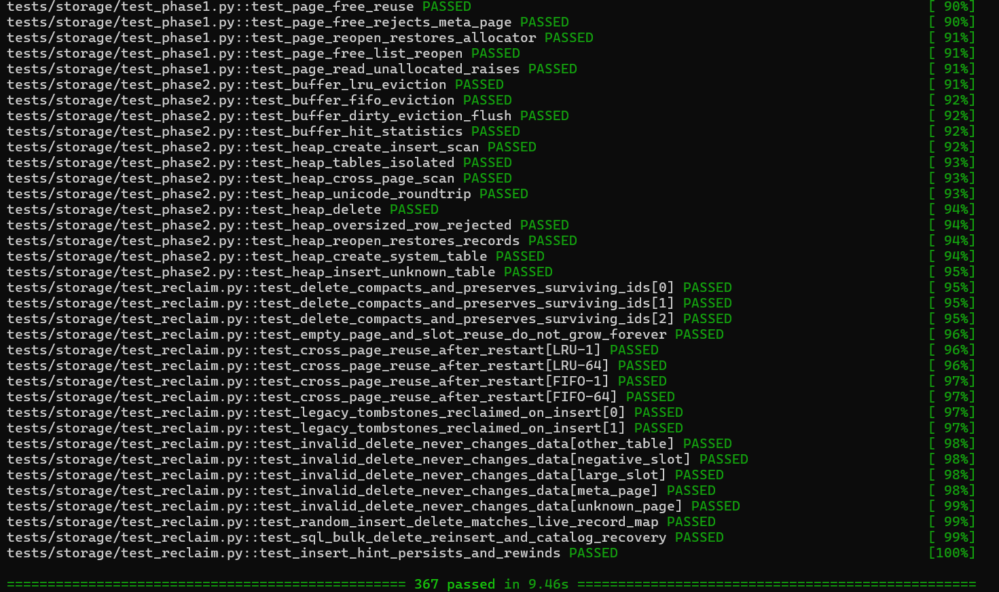
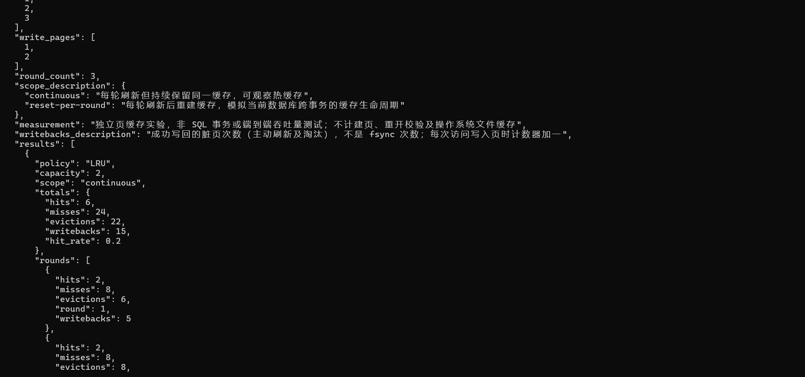
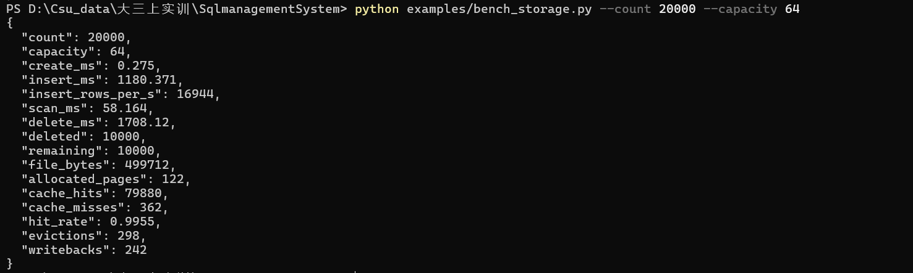
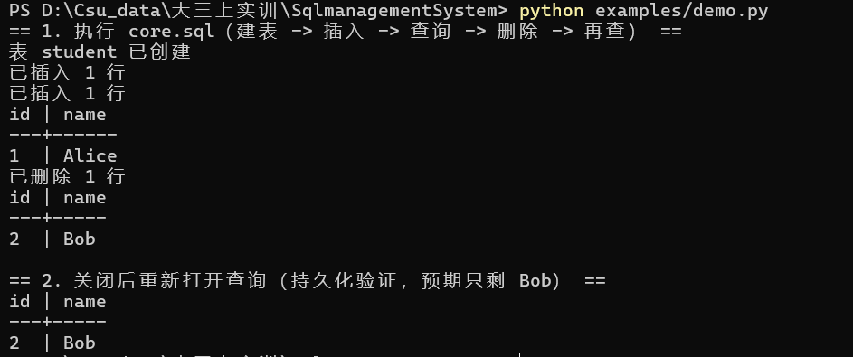

# 存储系统模块报告（成员二）

> 2026-09-12 最终软件验收：全套 1052 项通过，扩展实际执行与本轮修复结果以[最终验收报告](最终验收报告.md)为准。本文保留分阶段设计、测试数字及当时待办，旧阶段状态不代表当前未实现。

> 存储系统模块交付报告，数据均来自本地实测（Python 3.12 / pytest 8.3）。

## 1. 目的

实现 MiniSQL 的页式存储层：以 4KB 页为单位持久化表数据与 Catalog，提供
文件读写、页管理、记录编解码、缓冲池与堆存储能力，支撑编译器与执行引擎的上层功能。

## 2. 模块职责与交付物

| 组件 | 文件 | 职责 |
|---|---|---|
| FileManager | storage/file_manager.py | 文件随机读写、同步、关闭 |
| DiskPageManager | storage/page.py | 页分配/释放/读写、页 0 元信息、空闲页链表、格式版本 |
| RowCodec | storage/record.py | 记录编解码（V1：INT/VARCHAR；V2：新增 NULL 与全部新类型） |
| PageBufferPool | storage/buffer.py | LRU/FIFO 缓存、脏页写回、统计与替换日志 |
| HeapStorage | storage/record.py | 表根页映射、记录插入/扫描/删除、表结构重写、持久化 |
| BTreeIndex | storage/index.py | 键编码、B+ 树页布局、查找/范围扫描、插入/删除/分裂/合并/页回收 |
| MigrationTool | engine/migrate.py + cli/migrate.py | V1→V2 格式识别、备份、重建、原子替换与中断恢复 |
| RollbackJournal | storage/journal.py | 数据库级锁、写前回滚日志、提交同步与崩溃恢复 |

## 3. 关键设计决策

### 3.1 页格式（slotted page）

- 页大小 4096 字节，页头 24 字节、槽目录每项 5 字节。
- 槽目录向下增长、记录数据向上增长，中间为空闲空间。
- 页头字段：page_id / page_type / slot_count / free_start / data_end /
  next_free_page / next_data_page / table_id。
- 页类型：FREE（空闲链表）、DATA（数据页，next_data_page 串联同表数据页）、
  META（页 0 元信息页）。

### 3.2 空闲页管理

- 采用空闲页链表（页头 next_free_page 串联），页 0 元信息区持久化链表头。
- 分配时优先复用链表头页，链表空时递增 next_page_id。

### 3.3 table_id 与根页映射

- table_id=0 保留给 `__catalog`，用户表从 1 开始由 next_table_id 递增。
- 根页由 allocate_page 独立分配，不依赖页号与 table_id 对齐
  （数据页扩展会消耗页号，纯函数映射会失效）。
- `table_id -> root_page` 显式持久化在页 0 的映射区（下标 = table_id）。

### 3.4 记录编码

- 按格式版本分派：V1 仅 INT/VARCHAR 且无前缀；V2 每个值前有 1 字节可空标记
  （`0x00` 有值 / `0x01` NULL），支持 NULL 与全部新类型。
- INT：8 字节有符号大端（>q）；VARCHAR：2 字节长度前缀（按字节）+ UTF-8；
  BOOL：1 字节；DECIMAL：长度前缀 + 十进制文本；DATE：4 字节天数；
  TIME/TIMESTAMP：8 字节微秒数。
- bool 不得当作 INT 存储（反之亦然）；V1 遇到新类型或 NULL 报 `TYPE_MISMATCH`。
- 记录不跨页，单条最大 4067 字节。

### 3.5 缓冲池

- 用 OrderedDict 统一实现 LRU 与 FIFO：LRU 命中 move_to_end，FIFO 命中不动。
- 脏页淘汰前先写回；记录 CacheStats 与 ReplacementEvent 日志。

### 3.6 B+ 树索引（F09）

- 页类型 3/4（叶子/内部），复用页头 `next_free_page` 存内部节点 `child0`、
  `next_data_page` 存叶子后继；全键 = 列键 + rid（叶子）/ 子页指针（内部），
  重复列值也有唯一全键。
- 节点体上限 4072 字节，超限分裂；非根下溢阈值 2036，借用/合并/根塌缩并回收页。
- 键编码保序、自定界：NULL 排最前，INT/DATE/TIMESTAMP 符号翻转，VARCHAR 用
  `0x00 0x00` 结尾并转义 `0x00`，DECIMAL 用符号 + 整数位数 + 数字串。
- 索引页与数据页写同一文件，事务日志为整文件前映像，因此索引页随数据页一起
  提交、回滚与崩溃恢复，无需额外协议。

### 3.7 格式版本与迁移（F08/F06）

- 格式版本存页 0 页头 `reserved` 字节（V1=1、V2=2），历史 0 归一化为 V1，旧库可读且
  不被自动改写；新库写 V2。
- `engine.migrate` 采用“识别 → 备份 → 临时文件重建 → fsync → 原子替换”，保留
  `table_id`，中断后原库完好、可重跑且幂等；详见 [存储迁移说明](存储迁移说明.md)。

### 3.8 表结构重写（F06）

- `HeapStorage.rewrite_table(schema, new_schema, transform)`：整表先转换与编码，再写
  全新页链，最后原子切换 root_page 映射并回收旧页链；失败保持旧数据不变。
- 只提供存储层能力，不解析 SQL、不更新 Catalog；崩溃安全由调用方事务日志覆盖。

## 4. 测试记录

### 4.1 单元测试

| 文件 | 场景 | 数量 |
|---|---|---|
| tests/storage/test_phase1.py | FileManager、RowCodec、DiskPageManager | 17 |
| tests/storage/test_phase2.py | PageBufferPool、HeapStorage | 13 |
| tests/storage/test_acceptance.py | 验收场景 | 9 |
| tests/storage/test_reclaim.py | 删除空间回收、槽复用、页链释放 | 18 |
| tests/storage/test_cache_experiment.py | LRU/FIFO 缓存对比实验 | 10 |
| tests/storage/test_new_types.py | F08：NULL 与新类型编解码、BOOL/INT 区分、V1/V2 兼容 | 22 |
| tests/storage/test_index.py | F09：键编码顺序、分裂合并、范围扫描、重复键、页回收、重开与恢复 | 30 |
| tests/storage/test_rewrite.py | F06：表结构重写、物理结构原子替换与失败恢复 | 14 |
| tests/storage/test_real_storage.py | F01–F05：真实文件多表扫描、变长值、新类型与 NULL 往返 | 10 |
| tests/storage/test_migrate.py | F08/F06：V1→V2 迁移、备份、幂等、中断恢复 | 10 |

存储专项合计 153 项；`tests/storage/test_index.py` 与 `test_migrate.py` 中的子进程
崩溃测试覆盖中断与恢复再次中断。以上为本地实测收集数（2026-09-10，Python 3.12 /
pytest 8.3）。
（另：索引与全表扫描的性能证据见 [F09 索引接口约定](F09索引接口约定-成员二.md) 第 6 节。）

<!-- 截图待补：pytest 全套 723 项通过 -->


### 4.2 验收场景

| 场景 | 结果 |
|---|---|
| allocate_free_reuse_page（页分配/释放/复用） | 通过 |
| cross_page_scan（跨页扫描） | 通过 |
| unicode_row_roundtrip（中文字符串往返） | 通过 |
| oversized_row_rejected（过大记录拒绝） | 通过 |
| lru_replacement（LRU 替换） | 通过 |
| fifo_replacement（FIFO 替换） | 通过 |
| dirty_eviction_flush（脏页淘汰刷盘） | 通过 |
| hit_statistics（命中统计） | 通过 |
| reopen_records（关闭重开恢复） | 通过 |

### 4.3 缓存统计证据

用 `python -m minisql.cli.cache_experiment`（独立临时页文件，访问序列
`1,2,1,3,1,2,4,1,2,3`，写入页 `{1,2}`，3 轮）对比 LRU 与 FIFO：

| 策略 | 容量 | 生命周期 | 命中率 | 命中 | 未命中 | 淘汰 | 写回 |
|---|---|---|---|---|---|---|---|
| LRU | 2 | continuous | 0.200 | 6 | 24 | 22 | 15 |
| FIFO | 2 | continuous | 0.100 | 3 | 27 | 25 | 18 |
| LRU | 3 | continuous | 0.700 | 21 | 9 | 6 | 6 |
| FIFO | 3 | continuous | 0.500 | 15 | 15 | 12 | 12 |
| LRU | 4 | continuous | 0.867 | 26 | 4 | 0 | 6 |
| FIFO | 4 | continuous | 0.867 | 26 | 4 | 0 | 6 |
| LRU | 2 | reset-per-round | 0.200 | 6 | 24 | 18 | 15 |
| FIFO | 2 | reset-per-round | 0.100 | 3 | 27 | 21 | 18 |
| LRU | 3 | reset-per-round | 0.500 | 15 | 15 | 6 | 6 |
| FIFO | 3 | reset-per-round | 0.300 | 9 | 21 | 12 | 12 |
| LRU | 4 | reset-per-round | 0.600 | 18 | 12 | 0 | 6 |
| FIFO | 4 | reset-per-round | 0.600 | 18 | 12 | 0 | 6 |

结论：容量不足时 LRU 明显优于 FIFO（容量 3 连续访问命中率 0.700 对 0.500）；
容量足够覆盖工作集时二者一致；持续复用缓存（continuous）优于每轮重建（reset-per-round）。

<!-- 截图待补：cache_experiment 运行输出 -->


### 4.4 更大规模性能基准

用 `python examples/bench_storage.py`（独立临时文件，单表两列 INT+VARCHAR，
缓存容量 64）批量插入 / 扫描 / 删除。修复插入与删除路径后实测：

| 规模 | 插入耗时 | 扫描耗时 | 删除耗时 | 数据页数 | 缓存未命中 |
|---|---|---|---|---|---|
| 5,000 条 | 332 ms | 14.6 ms | 472 ms | 31 | 30 |
| 10,000 条 | 682 ms | 29.7 ms | 905 ms | 60 | 59 |
| 20,000 条 | 1.18 s | 59.4 ms | 1.80 s | 122 | 362 |

20,000 条时插入吞吐约 16,884 行/秒、删除约 5,563 行/秒，文件 499,712 字节
（122 页），缓存命中率 0.9955。

**扩展性问题修复**：优化前插入与删除耗时均随规模平方增长（20,000 条插入
101.9 s、删除 6.63 s，未命中 127 万）。根因与修复：

1. `insert` 每次从根页沿 `next_data_page` 线性扫描到首个有空闲的页，复杂度 O(N²)。
   修复为维护「插入候选页指针」（复用根页头 `next_free_page` 持久化）：插入从
   候选页开始、填满后前进，删除使靠前页出现空洞时回拨。
2. `delete` 为校验 `RecordId` 归属，每次从根页遍历到目标页，复杂度 O(N·页数)。
   修复为在页头 `reserved` 区持久化 `table_id`，删除直接按 `page_id` 定位并 O(1)
   校验（页号范围、页类型、所属表、槽有效）。

修复后插入与删除均近似线性，缓存未命中从 127 万降至 362。

<!-- 截图待补：bench_storage 性能基准输出 -->


### 4.5 持久化证据

- 关闭文件后重新打开，页分配器、空闲链表、表根页映射与记录均完整恢复。
- 真实文件重开演示（`python examples/demo.py`）命令输出：

  ```
  == 1. 执行 core.sql（建表 -> 插入 -> 查询 -> 删除 -> 再查） ==
  表 student 已创建
  已插入 1 行
  已插入 1 行
  id | name
  ---+------
  1  | Alice
  已删除 1 行
  id | name
  ---+-----
  2  | Bob

  == 2. 关闭后重新打开查询（持久化验证，预期只剩 Bob） ==
  id | name
  ---+-----
  2  | Bob
  ```

  关闭后重开只查到 Bob，证明插入与删除均已正确落盘。

<!-- 截图待补：demo.py 持久化重开演示输出 -->


## 5. 关键技术难点与解决

1. **根页映射对齐问题**：最初设计 `root_page = table_id + 1` 纯函数映射，
   发现数据页扩展会消耗页号导致映射失效，改为页 0 显式映射区。
2. **脏页淘汰顺序**：脏页必须先写回再淘汰，否则丢失未落盘修改。
3. **中文字符串边界**：VARCHAR 长度前缀按 UTF-8 字节数计，编解码两侧一致。
4. **插入的 O(N²) 页链扫描**：`insert` 每次从根页线性扫描到尾页，数据量增大时
   耗时平方增长。通过持久化「插入候选页指针」（复用根页头 `next_free_page`），
   插入从候选页开始、删除时回拨靠前空洞，已消除平方增长，详见 4.4。
5. **删除的 O(N·页数) 归属校验**：`delete` 为校验 `RecordId` 归属每次从根页遍历
   到目标页。通过在页头 `reserved` 区持久化 `table_id`，删除直接定位并 O(1)
   校验，消除平方增长，详见 4.4。
6. **旧格式兼容而不迁移**：新类型与 NULL 需要每值前缀，直接改旧记录编码会破坏旧库。
   解决为版本化编解码（V1/V2）+ 页 0 页头 `reserved` 字节承载版本号（历史文件恒 0，
   归一化为 V1），旧库原样可读、不自动改写。
7. **表结构变更的失败安全**：`rewrite_table` 先完成整表转换与编码，再写新页链，最后
   切换根页映射并回收旧页链；任何类型/转换错误都不触碰旧结构，旧数据可继续读写。
8. **迁移的中断安全与幂等**：迁移在临时文件内重建，`fsync` 后原子替换；替换前原库
   完好，重跑自动清理残留并重新迁移，已迁移库再次调用为空操作；存在未处理事务日志
   时拒绝迁移，避免把未恢复的数据当作基线。

## 6. 结论与小结

存储层已独立完成并通过全部单元测试与验收场景，可支撑上层执行引擎的
RecordStorage 协议调用。与编译器、执行引擎联调后，建表、插入、扫描、删除、
关闭重开、事务与崩溃恢复均在真实文件中通过。

本轮 SQL 扩展的存储交付：

- **F08**：V1/V2 版本化编解码、NULL 与 BOOL/DECIMAL/DATE/TIME/TIMESTAMP，
  严格区分 BOOL/INT；
- **F06**：`rewrite_table` 表结构重写与物理结构原子替换、失败保持旧数据；
- **F06/F08**：V1→V2 迁移工具（备份、原子替换、中断可重跑、幂等、保留 table_id）；
- **F09**：B+ 树页布局、键编码、查找、分裂、合并、页回收与索引增删扫描接口；
- **F01–F05**：真实文件夹具，验证多表扫描、变长值与新类型往返。

真实文件重开、跨页与容量边界、损坏输入、迁移中断、恢复再次中断均已由专项测试覆盖
（`tests/storage/test_new_types.py`、`test_index.py`、`test_rewrite.py`、
`test_real_storage.py`、`test_migrate.py` 与 `tests/integration/test_recovery.py`）。
本地实测：存储专项 153 项、全套 723 项通过、无跳过（2026-09-10）。
大规模基准曾暴露插入与删除的 O(N²) 问题，已分别通过插入候选页指针与页头
归属校验修复，插入与删除均近似线性。

## 7. AI 辅助使用说明

- 使用 AI 辅助进行设计分析、代码生成与单元测试编写。
- 关键设计决策（页格式、根页映射、缓冲池策略）经人工确认后落地。
- 具体工具与使用方式：以 AI 助手完成页格式与缓冲池方案讨论、
  RowCodec / HeapStorage / 回滚日志及测试用例的代码生成；事务恢复边界与性能
  基准脚本由 AI 协助编写，所有正确性结论均经本地运行测试验证。
