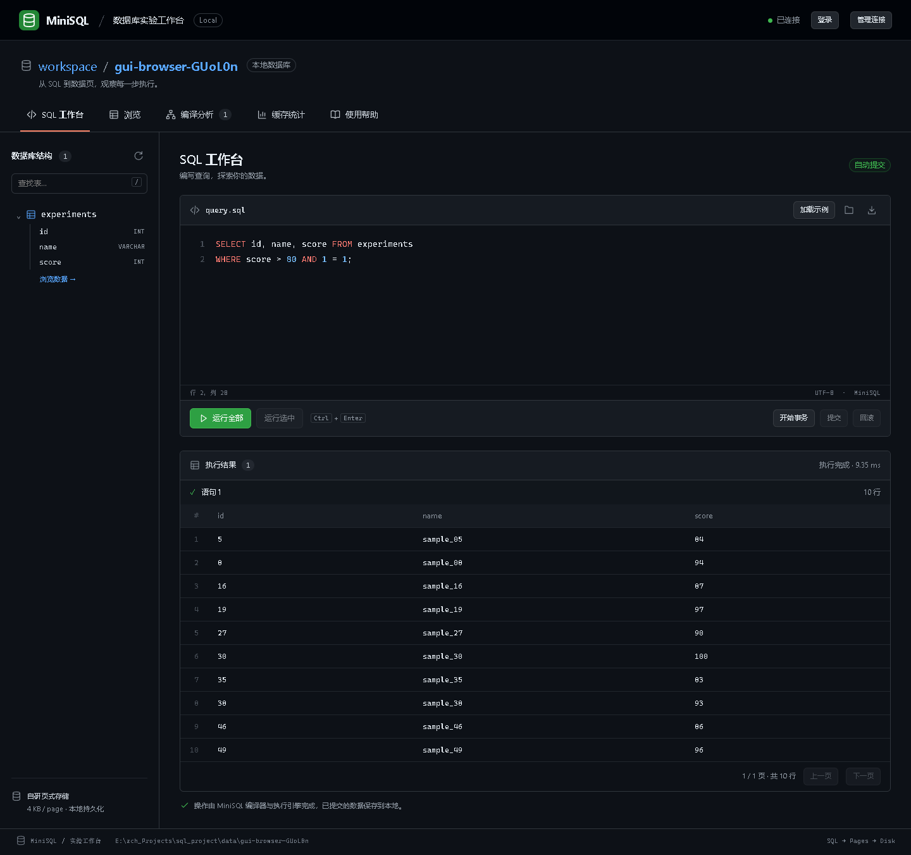
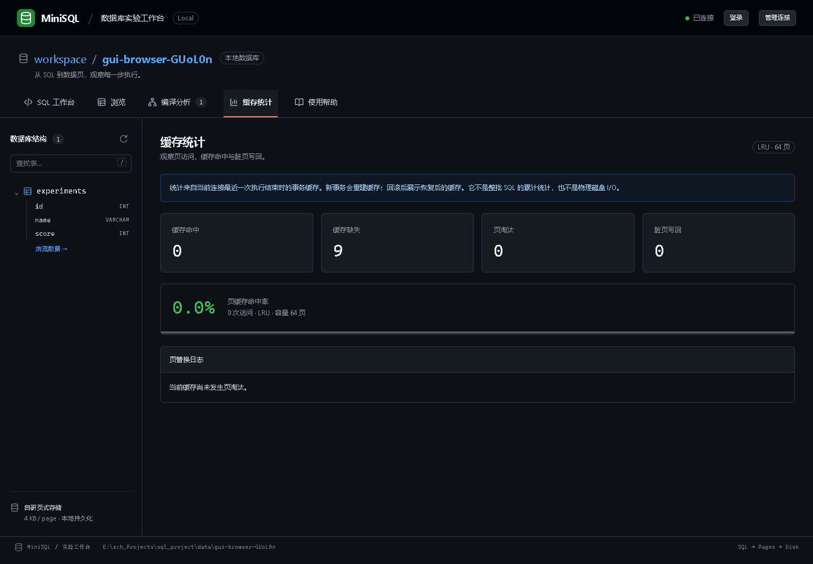

# MiniSQL 图形工作台

## 启动与关闭

在项目根目录 `E:\zch_Projects\sql_project` 双击 `start_gui.cmd`。脚本优先使用项目的 `.venv`，没有虚拟环境时使用 Windows 的 `py -3`，并直接从本项目源码加载 MiniSQL。

启动后自动打开 `http://127.0.0.1:8765`，默认连接独立的 `data/gui`。页面资源全部随项目提供，不访问 CDN，不需要 Node.js，也不使用其他数据库。

若需要手动启动：

```powershell
cd E:\zch_Projects\sql_project
.\.venv\Scripts\python.exe -m minisql.gui
.\.venv\Scripts\python.exe -m minisql.gui --data-dir .\data\practice --port 8767
```

安装或重新安装项目后也可使用 `minisql-gui` 命令。`--no-browser` 表示只启动服务；`--port 0` 让系统分配空闲端口，实际地址打印在启动窗口中。端口冲突会给出提示，不会强行关闭其他程序。

服务窗口保留运行，按 Ctrl+C 正常关闭；所有连接的未提交事务会回滚。关闭浏览器页面时会发送连接释放请求；浏览器异常离开时，连接空闲 30 分钟后回收。结束实验时建议先提交或回滚，然后点击「管理连接 → 断开连接」。

## 界面与基本操作

界面参考 GitHub Dark 的深色背景、顶部导航、细边框、蓝色链接与绿色按钮。首页左侧显示真实表结构，中间编辑 SQL，下方显示结果。



- **连接**：右上角输入本地数据库目录。不存在的目录会创建；相对路径以启动服务的目录为基准。切换前存在未提交事务时，确认后回滚再切换，也可以取消并手动提交。
- **编写 SQL**：支持行号、语法高亮、Tab 插入两个空格、Ctrl+Enter 运行选中内容或全部语句。选中执行保留原编辑器行列位置。
- **示例**：初始编辑器提供入门代码，加载示例只替换编辑器，不自动执行。重复执行建表会报同名表错误，可只选中查询部分。
- **表结构**：支持按名称筛选表；上边栏「浏览」列出全部数据表，点击表名查看结构与数据并分页；刷新按钮读取最新目录。
- **文件**：打开 UTF-8 SQL 文件，保存按钮下载编辑器内容。打开文件最多 240 KB；服务请求体最多 256 KB（含 JSON 包装和转义）。超过限制需拆分执行。
- **结果**：成功批次逐语句展示查询结果、影响行数与消息。每页显示 50 行，翻页不再次执行 SQL；分页属于显示层，执行引擎仍一次性生成完整结果集。

字段类型支持 INT、VARCHAR；布尔常量用于表达式，不支持 BOOL 表列。INSERT 必须列出全部列名。完整语法以 [文法说明](grammar.md) 为准。

## 事务、错误与多页面

默认每条语句自动提交。通过按钮或 SQL 执行 BEGIN、COMMIT、ROLLBACK；事务出错后界面禁用提交，提示必须回滚。

批次整段传给原有 `execute`：遇错停止，失败批次不返回部分结果；之前自动提交的语句可能已经生效，需要再次 SELECT 核实。界面不会声称整批操作已经撤销。

每个页面拥有单独连接和固定工作线程。多个页面访问同一库时，显式事务占用数据库独占锁，其他页面可能收到 DATABASE_BUSY；结束占锁事务后可以重试。单服务最多 16 个页面会话，长时间闲置的会话会超时，页面会提示刷新。

错误显示阶段、错误码、原因、期望符号和源码位置；点击定位按钮可跳到编辑器中的出错处。编译未完成的语句没有完整分析结果。文件、连接或网络错误会明确提示，不自动重复提交 SQL。

## 教学分析与统计口径

「编译分析」展示最近一批 SQL 中成功编译的各语句，包括 Token 流、可展开的 AST、绑定后的语义信息及优化前后执行计划。采集包装真实编译调用，不重新编译或执行。编译成功不保证执行或提交成功。

「缓存统计」展示最近一次执行结束时，当前连接所持有页缓存的命中、缺失、淘汰、成功脏页写回与替换日志。包含该缓存生命周期内的目录访问；新事务重建缓存，回滚后显示恢复后的缓存。

这些数值**不是整批 SQL 累计量、物理磁盘 I/O、fsync 次数或吞吐量基准**。刷新表结构不会覆盖界面上最近执行的统计快照。需要 LRU/FIFO 对比时使用现有 [缓存实验](编译跟踪与缓存实验.md)。



## 本地接口与实现

图形界面代码独立放在 `src/minisql/gui`，不修改数据库文件格式和核心执行语义。Python 标准库 HTTP 服务提供静态资源；页面使用原生 HTML/CSS/JavaScript。

| 接口 | 用途 |
|---|---|
| GET `/api/config` | 获取服务的同源请求令牌与默认目录 |
| POST `/api/session` | 新建独立页面会话 |
| POST `/api/connect` | 为会话连接指定目录 |
| POST `/api/state` | 刷新表结构和连接状态；无显式事务时通过引擎事务锁重载目录 |
| POST `/api/execute` | 整批执行 SQL，返回结果、编译快照、缓存与事务状态 |
| POST `/api/disconnect` | 关闭数据库连接，回滚未提交事务，页面会话保留供重连 |
| POST `/api/close` | 关闭并释放页面会话 |

POST 需要 `X-MiniSQL-Token`，已有会话还需在 JSON 中携带 `session`。服务验证 Host、Origin 与令牌，仅监听 `127.0.0.1`，不支持公网或局域网发布。数据库内容用文本节点渲染，配合内容安全策略防止结果被当成网页脚本。

## 验证

新增 15 项测试覆盖核心读写与恢复、编译只采集一次、原批次错误契约、事务状态、切换连接、多会话冲突、关闭回滚、来源校验、静态资源、输入边界和空闲回收。交付时全套 **566 项通过**。

```powershell
# 路径需尚未存在；避免 pytest 清理已有目录。先确保 data 存在。
New-Item -ItemType Directory -Path data -Force
.\.venv\Scripts\python.exe -m pytest -q -p no:cacheprovider --basetemp data/gui-test-new
```

浏览器验收脚本为 `tests/browser/gui.cjs`，需要可选的 Node.js 与 Playwright，仅用于开发验证，不是运行依赖。脚本启动独立服务和临时数据库，检查键盘、选区、错误定位、编译、缓存、事务、分页、文件打开保存、HTML 文本显示、多页面和目录切换，以及 390 px 窄屏布局。截图使用真实测试数据，不是产品预置内容。

```powershell
# Playwright 已可被 Node.js 解析时
node tests/browser/gui.cjs
```

也可通过 `MINISQL_PLAYWRIGHT` 指定 Playwright 模块路径、`MINISQL_BROWSER` 指定浏览器可执行文件、`MINISQL_PYTHON` 指定 Python。脚本使用独立浏览器，结束时关闭浏览器和测试服务。
