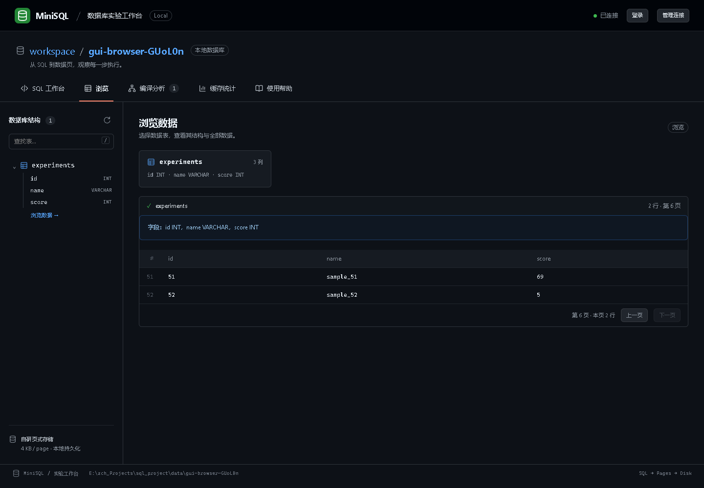
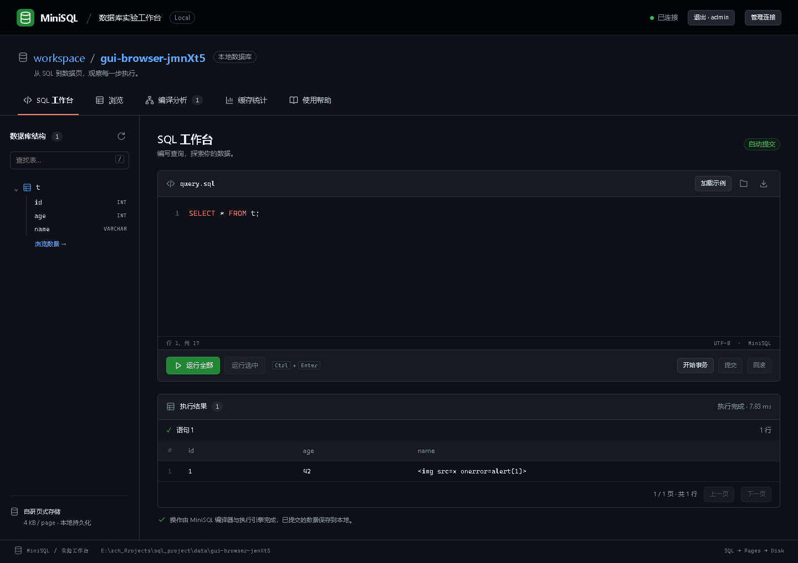

# MiniSQL 最终软件验收报告

验收日期：2026-09-12（北京时间）。

**结论：指导书要求的软件核心功能及本报告列出的扩展场景通过本轮验收。最终全套 Python 测试 1052 项通过，0 失败、0 错误、0 跳过；耗时 51.28 秒。两套真实浏览器脚本、CLI 演示、编译跟踪、缓存实验、真实 SQL 索引对比和安装包隔离运行均通过。**

本报告验收对象是本地 `0dfae0f` 基线加本轮修复，不代表此前提交或远端版本已经包含这些修复。本轮未提交、未推送，也未迁移或修改业务数据库。

软件验收不等于老师评分或所有可能 SQL 的正确性证明。正式实践报告的个人信息、各成员小结、其他成员机器上的安装及现场讲解仍须由小组完成；不将这些人工交付项虚报为通过。

## 1. 依据、环境与方法

- 依据：《大型平台软件设计实习》指导书，2025 年 4 月版本，共 10 个 PDF 页面；以下页码按 PDF 文件页码计。
- 系统：Windows 11，Python 3.12.14；浏览器使用本机 Chrome，由 Playwright 自动操作。
- 数据隔离：pytest 使用本项目新建的 `.test-tmp-*` 目录；浏览器、性能和安装验收使用 `data/` 下独立目录。没有使用原业务库作为测试对象。
- 方法：先重跑原有测试建立基线，再按指导书核查覆盖；新增跨模块真实 SQL 场景，复现缺陷、修复并回归。结果集、错误码、重启结果与页访问计数使用断言；耗时不作不稳定的通过阈值。
- 基线：原有 1011 项全绿，但新增场景仍发现缺陷。因此最终判断结合专项与实际演示，不只依据测试数量。

## 2. 指导书必做项核对

| 要求与页码 | 验收内容 | 证据 | 结论 |
|---|---|---|---|
| 词法规则与 Token，3、5～7 页 | 种别、词素、行列；非法输入定位 | compiler 测试、`final-trace.jsonl` | 通过 |
| AST 与四类基本 SQL，3、5 页 | CREATE TABLE、INSERT、SELECT、DELETE；语法错误与期望符号 | compiler、integration 测试 | 通过 |
| 语义检查与 Catalog，3、5 页 | 表列存在性、类型、INSERT 列数列序、重复定义 | compiler、errors、catalog 测试 | 通过 |
| 计划生成和中间结果，3、6～7 页 | Token→AST→语义→计划；优化前后展示 | trace 连续两次执行、GUI 编译页 | 通过 |
| 页式存储，4～5、7～8 页 | 4KB 页分配、释放、读写，记录序列化，表页映射 | storage、reclaim、drop_table 测试 | 通过 |
| 缓存管理，4～5、7 页 | LRU/FIFO，命中统计、淘汰日志、脏页写回 | 12 组独立缓存实验与 GUI 缓存页 | 通过 |
| 执行引擎与系统目录，4～6、8 页 | 执行算子调用真实存储，系统目录作为特殊表保存 | 真实文件 integration 与对象目录测试 | 通过 |
| 数据与元数据持久化，6、8 页 | 关闭重开、建删表、目录、新类型、索引与账户恢复 | CLI 重启演示、持久化专项 | 通过 |
| 大量数据与正确性，6 页 | 100/1000/10000 行真实数据库；过滤与结果一致性 | `final-sql-benchmark.json` | 通过本次规模 |
| 交互与反馈，4、6 页 | CLI 文件/交互、GUI、位置提示、错误及成功结果 | 两套浏览器脚本、CLI 演示 | 通过 |
| 测试报告与截图，8 页 | 测试结果、步骤、截图、分析、限制 | 本文及 assets 中证据 | 本轮软件验收材料已提供 |
| 完整实践报告，8～10 页 | 目的、内容、方法、步骤、结果、结论、个人小结 | 已有模块报告；需整合个人与课程交付信息 | 不属于本次软件通过结论 |

## 3. 扩展功能结果核对

扩展不是指导书最低要求。下表表示已执行列出的代表场景，不表示覆盖这些语法的任意嵌套或任意规模。

| 功能 | 本轮执行或全套回归覆盖 |
|---|---|
| 多表连接 | INNER、LEFT、RIGHT、CROSS，外连接补 NULL；学生与成绩表 JOIN |
| 聚合分组 | COUNT(*)、COUNT(列)、SUM、AVG、MIN、MAX；GROUP BY/HAVING；空集 COUNT=0，其余相应聚合为 NULL |
| 子查询 | 相关 EXISTS、IN、NOT IN 含 NULL、标量零行与多行错误、FROM 派生表；嵌套子查询权限 |
| 集合操作 | UNION、UNION ALL、INTERSECT、EXCEPT，去重和集合后排序 |
| 别名与表达式 | 表/列别名、计算列、排序分页、中文、NULL 三值逻辑、算术与溢出 |
| 表结构变更 | 增列默认值、删列、改列名、存量 INT 列提升为 DECIMAL、失败恢复 |
| 约束 | 主键、唯一、NOT NULL、CHECK、DEFAULT、外键；ADD/DROP CHECK 的运行生效、存量验证与重启；整批唯一键交换和冲突回滚 |
| 新类型 | SQL 写入与重开验证 DATE/TIME/TIMESTAMP/BOOL、DECIMAL；精度参数保留；整数赋值提升 |
| 索引 | 单列及联合最左前缀、范围、重复条件、含 NULL 的唯一索引；跨页分裂；更新搬移后回表；回滚与强退恢复；真实 SQL 无全表扫描 |
| 视图 | 查询、嵌套依赖保护、DECIMAL 元数据及重启；视图和底层对象权限 |
| 触发器 | INSERT/UPDATE/DELETE、OLD/NEW；实际动作冲突回滚主表及索引；与进程强退组合恢复 |
| 用户与权限 | 首个管理员、登录、授权撤权、嵌套访问控制；改密与旧会话失效；GUI 登录流程及敏感字段脱敏 |

新增验收代码：[test_final_acceptance.py](../tests/integration/test_final_acceptance.py)，共 41 项。学生—课程综合场景同时验证约束、精确分数、JOIN/聚合、相关查询、视图、索引、触发器、回滚、账户权限与重启，避免只验证各模块孤立可用。

## 4. 本轮发现与修复

| 问题 | 修复及验证 |
|---|---|
| UPDATE 不改变索引键，但改变物理记录位置，索引仍指向旧位置 | 整批移除旧索引项并写入新 RecordId；中文变长更新、跨页和重启验证 |
| 联合索引部分键或重复条件形成错误边界 | 支持最左列前缀边界，按列生成上下界，保留完整残余过滤；与扫描结果逐项比较 |
| 联合唯一索引错误拒绝部分列为 NULL 的重复键 | 与 UNIQUE 约束一致，仅所有键列均非 NULL 时查重；覆盖建索引和后续插入 |
| 外键错误拒绝父行非键更新，逐行查重错误拒绝整批键交换 | 按整条语句最终行集验证唯一性与引用，再执行物理写入；冲突仍整体回滚 |
| ALTER ADD/DROP CONSTRAINT 编译成功但未完整保存运行期约束，未检查存量 | 保存完整约束目录并验证存量行，失败回滚；跨重启验证 |
| INT→DECIMAL 在 INSERT/UPDATE/ALTER 中语义允许、存储却拒绝 | 在写入和表重写边界完成无损提升，编码器继续拒绝不兼容或超范围值 |
| 集合操作后 ORDER BY 丢失输出字段绑定 | 集合计划保存输出作用域，结果挂接相同绑定；UNION/UNION ALL/EXCEPT 排序验证 |
| IndexScan 回表仍扫描全部记录 | 新增 `fetch(schema, RecordId)`，验证页槽与归属后直接读取；禁止扫描的回归断言、真实 SQL 性能实验 |
| 扫描统计只排除编号 0，未排除其他内部系统表 | 排除内部系统表，避免将元数据读取计入用户扫描行数 |
| CLI 演示子进程在 Windows 输出编码与 UTF-8 解码不一致 | 显式以 UTF-8 启动子进程，增加完整演示回归 |
| GUI 旧验收按 3 条示例断言，新版示例已是 52 条 | 更新为真实 52 条数据与六页浏览，另验证 108 行结果的前端分页不重复执行 SQL |

新增 `RecordStorage.fetch` 已同步公共接口、真实堆存储及内存测试替身。集合计划新增 `output_scope`，供执行层恢复集合结果的字段绑定。没有引入新运行时第三方依赖。

## 5. 最终自动化结果

| 分组 | 通过数 |
|---|---:|
| 编译器 | 354 |
| 存储 | 167 |
| 执行引擎 | 41 |
| 集成 | 337 |
| SQL Fuzz | 123 |
| 公共契约 | 30 |
| **合计** | **1052** |

[JUnit 原始结果](assets/final-pytest.xml)。pytest 控制台总时间为 51.28 秒，JUnit 内部 suite 时间约 51.23 秒；统计边界略有差异。

[文件校验清单](assets/final-manifest.json)记录源码、测试与验收证据的 SHA-256；已核对最终安装包中的源码与工作区相同，文档本地链接及证据统计一致。

全套中包括多进程串行访问、锁超时、提交标记前后强退、恢复再次中断、I/O 故障注入、旧格式迁移及损坏输入保护。本轮额外验证未提交/已提交的索引 UPDATE 和触发器记录在真实子进程退出后的共同恢复。

浏览器通过：SQL 操作、快捷键、选区执行、错误位置、编译和缓存展示、显式事务、失败后回滚、文本转义、SQL 文件中文往返、多页面锁等待、断开回滚、目录切换、390px 窄屏、EXPLAIN、登录改密与旧会话失效。检查过程中未捕获页面脚本错误。

CLI：完整五阶段演示通过；编译跟踪示例在同一隔离数据库连续运行两次通过。证据：[CLI 输出](assets/final-cli.txt)、[编译事件](assets/final-trace.jsonl)。

安装包：构建 wheel 后离线安装至独立目录，在 Python 隔离导入模式下验证真实建表、索引查询、三个帮助/版本入口，以及四个 GUI 静态资源。[安装验证结果](assets/final-package.json)。开发虚拟环境缺少 setuptools，首次无构建隔离的打包失败；随后使用本机已具备 setuptools 84.0.0 的运行环境完成构建。这不等于已在其他同学的机器上验收。

## 6. 性能与缓存实验

### 6.1 真实 SQL 索引对比

脚本：[final_sql_benchmark.py](../examples/final_sql_benchmark.py)。表为 `t(id INT,name VARCHAR)`，查询一个中间位置的等值键，索引前后结果必须一致。

| 行数 | 扫描路径用户扫描行 | 索引路径用户扫描行 | 扫描页缺失 | 索引页缺失 | 扫描查询 ms | 索引查询 ms |
|---|---:|---:|---:|---:|---:|---:|
| 100 | 100 | 0 | 1 | 2 | 0.463 | 0.558 |
| 1000 | 1000 | 0 | 6 | 3 | 2.592 | 0.534 |
| 10000 | 10000 | 0 | 54 | 3 | 22.126 | 0.500 |

“索引扫描行 0”表示没有调用全表扫描接口；实际仍按记录位置读取了一条匹配记录，不表示没有读取数据。页缺失是缓冲池缺失，不是物理磁盘硬件 I/O 次数。

测量在显式事务中执行，排除 BEGIN/ROLLBACK 的整库日志成本；目录已加载，第一次查询的用户数据页未预热，第二次为同事务热查询。本次三种规模的两条路径热查询页缺失均为 0。耗时为本机单次测量，不能推广为稳定吞吐量或通用加速倍数。

结论：小表使用索引可能更慢且多读页；在本次万行等值查询中，索引将页缺失从 54 降至 3。该结论来自真实 SQL 路径，与旧版只测索引存储 lookup 的实验口径不同。[原始数据与完整计划](assets/final-sql-benchmark.json)

### 6.2 页缓存

容量 2/3/4 × LRU/FIFO × 持续缓存/每轮重建，共 12 组，每组 3 轮。输出命中、缺失、淘汰、成功脏页写回及替换日志，并由实验代码重开校验写入内容。[原始数据](assets/final-cache.json)

这是独立页访问重放实验，不能作为 SQL 事务吞吐量证据；不同访问序列下策略优劣可能改变。

## 7. 截图

查询工作台，52 条示例中的条件查询：


真实浏览第六页，末页 2 行：



缓存统计：


改密后以新密码重新登录：



[窄屏完整截图](assets/final-gui-mobile.png)已检查无页面级横向溢出；宽结果允许在内容区横向滚动。

## 8. 复验命令

在项目根目录、已安装测试依赖的环境中执行：

```powershell
$finalTemp = Join-Path (Get-Location) ('.test-tmp-' + [guid]::NewGuid().ToString('N'))
.\.venv\Scripts\python.exe -X utf8 -m pytest -q -p no:cacheprovider --basetemp $finalTemp --junitxml=docs/assets/final-pytest.xml
.\.venv\Scripts\python.exe -X utf8 examples/demo.py
.\.venv\Scripts\python.exe -X utf8 examples/final_sql_benchmark.py --output docs/assets/final-sql-benchmark.json
.\.venv\Scripts\python.exe -X utf8 -m minisql.cli.cache_experiment --capacities 2 3 4 --rounds 3
```

浏览器测试需要额外安装 Playwright 及浏览器，仅属于测试工具，不是 MiniSQL 的运行依赖。执行 `node tests/browser/gui.cjs` 和 `node tests/browser/update.cjs`；可用 `MINISQL_PLAYWRIGHT`、`MINISQL_BROWSER`、`MINISQL_PYTHON` 指向本机安装位置。脚本自行启动隔离服务并在退出时关闭浏览器和服务。

## 9. 保留边界与交付事项

- 事务采用整库独占锁和完整文件前映像日志；不支持 MVCC、行锁、保存点或嵌套事务。
- 这是受限 SQL 子集。未宣称完整 SQL 标准兼容、完整代价优化器、任意类型自动转换或通用谓词下推。
- 单记录不跨页，查询结果使用物化收集；大库、多用户高并发不在本次课程规模验收范围。
- 旧六列索引目录可兼容恢复，但登记物理索引仍需显式升级；没有迁移真实业务库。
- 当前机器验证为 Windows/Python 3.12/Chrome；没有将 Linux、macOS、其他 Python 版本或其他成员机器标为实测通过。
- 答辩应使用本报告与当前代码一致的版本。课程完整实践报告的个人信息、个人小结及现场讲解准备，由小组继续完成。

本轮已复现的问题均有修复及通过证据，没有保留失败测试或通过跳过掩盖失败。后续修改业务代码或测试条件后，应重新生成验收证据。
